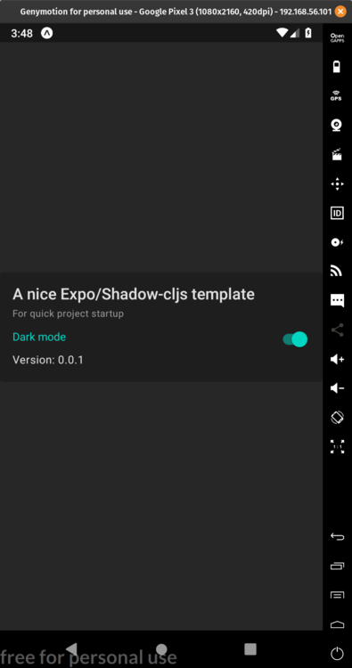

{:title "A template for Expo apps with Shadow CLJS" :layout :post :tags []}

# Summary

This [repo](https://github.com/jgoodhcg/shadow-cljs-expo-starter) is a template for [Expo](https://expo.io/) projects using [Shadow CLJS](https://shadow-cljs.github.io/docs/UsersGuide.html). By cloning this repo and following the starter instructions in the [readme](https://github.com/jgoodhcg/shadow-cljs-expo-starter#new-project-starter) you will be all setup to starting making a cross platform native app using Clojure.

# Benefits

This project has an opinionated set of all the necessary dependencies for an expo project written in cljs. 
- Staple libraries [Specter](https://github.com/redplanetlabs/specter), [Spec-tools](https://github.com/metosin/spec-tools), and [Camel-snake-kebab](https://clj-commons.org/camel-snake-kebab/)
- [Re-frame](https://github.com/day8/re-frame) for state management
- Unit tests for re-frame handlers and subscriptions using shadow-cljs [node tests configuration](https://shadow-cljs.github.io/docs/UsersGuide.html#target-node-test) 
- [CircleCI](https://circleci.com/) setup for unit tests (no expo build or publishing yet)
- [Dependabot](https://dependabot.com/) for javascript deps
- A nice [component library](https://callstack.github.io/react-native-paper/getting-started.html) with an example of [toggling dark mode](https://github.com/jgoodhcg/shadow-cljs-expo-starter/blob/master/src/main/new_project_name/app.cljs#L50-L53)

