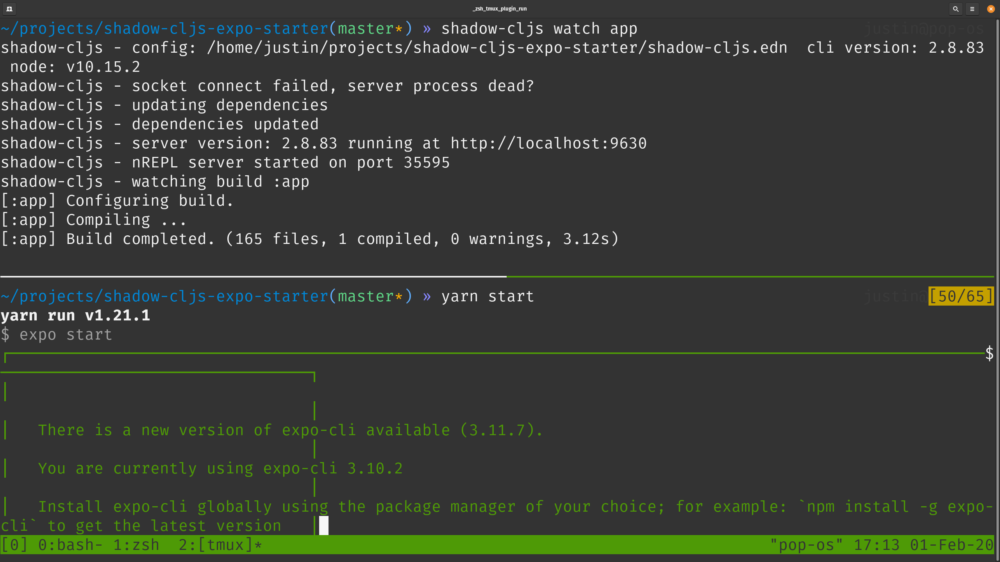
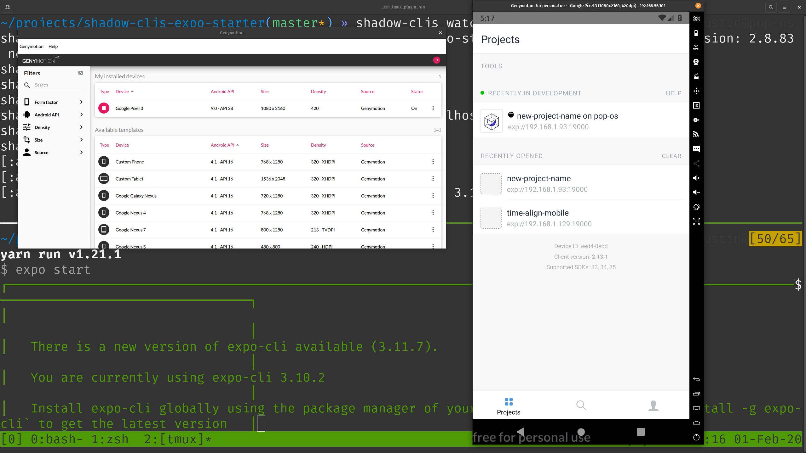
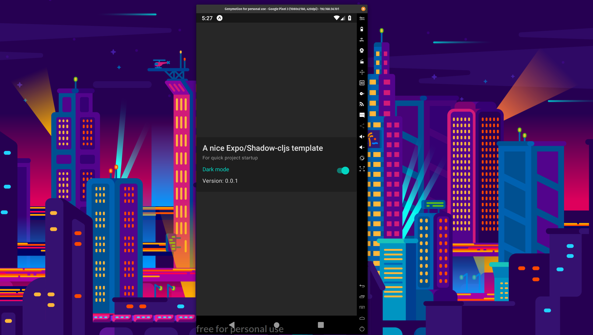
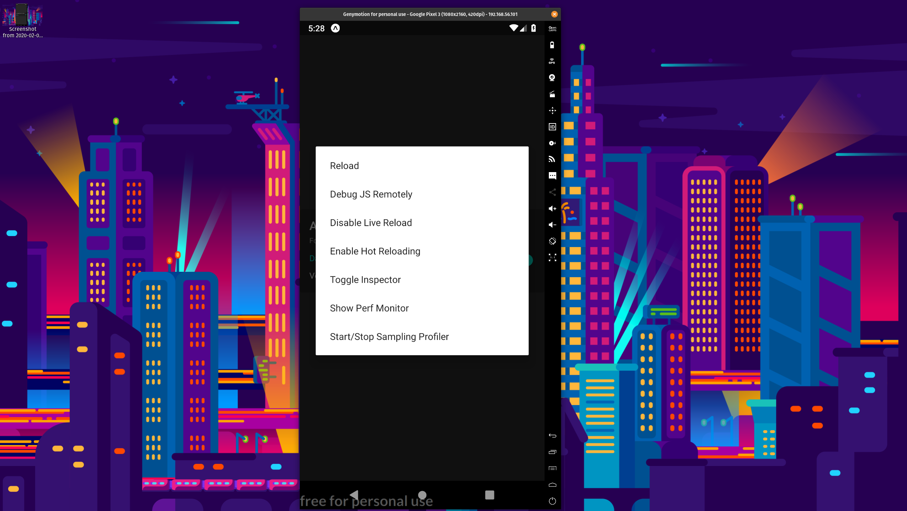

{:title "A template for Expo apps with Shadow CLJS" :layout :post :tags ["expo" "cljs" "shadow-cljs"]}

Do you want to make a native app? Are you familiar with a React stack? Do you also want to write in Clojure? Then the solution is -- [Expo](https://expo.io) with [Shadow CLJS](https://shadow-cljs.github.io/docs/UsersGuide.html). It's an easy technology transition and a well maintained platform to build on. I've used Expo with plain Javascript at my day job for a couple of years. My most significant personal project is an Expo app written in CLJS

# Why

To be honest, I would prefer if the world ran on progressive web apps (PWAs).  If your project can fit within [what web can do](https://whatwebcando.today/) then go for it.

However, sometimes a PWA won't cut it. Device capabilities like push notifications [^1] and geofencing are only available to native apps. The stores can also be a marketing boon. 

My day job needed a native app and so did one of my personal projects. Geofence ability was an important feature for my personal project. My day job wanted a presence in the app stores and the ability to do push notifications to all users on iOS and Android.

For my personal projects I also _had_ to use [Clojure](https://clojure.org/). Clojure is a great general language. [There](https://clojure.org/about/rationale) are a [bunch](https://youtu.be/BThkk5zv0DE) of [reasons](https://news.ycombinator.com/item?id=20773921) to use it. There are a few flavors but I've been using ClojureScript (CLJS) the most. It compiles to Javascript. If you want to take your first steps with clojure I recommend [these practice problems](http://www.4clojure.com/), and a [few](https://www.braveclojure.com/) general [resources](https://lambdaisland.com/) for [learning](https://sekao.net/lightmod/). Here is a [composite list of resources for beginners](gist.github.com/yogthos/be323be0361c589570a6da4ccc85f58f) from a prominent Clojure community member.

# How
The goal of this post is to get you setup with a native app project that uses Expo and CLJS. To make it easy for you (and me) I made [a template repository](https://github.com/jgoodhcg/shadow-cljs-expo-starter). It has a selection of opinionated library choices that are _necessary_ to make a real app.

## Tools
Let's start with my system setup. I'm running [PopOS](https://system76.com/pop), which is almost the same as Ubuntu. [Spacemacs](https://www.spacemacs.org/) is my editor of choice. I use [Cider](https://github.com/syl20bnr/spacemacs/tree/master/layers/%2Blang/clojure) as my editor/CLJS integration.

To develop an Expo/CLJS project I have these things open the whole time:
- Browser (for [debugging](https://docs.expo.io/versions/latest/workflow/debugging))
- Terminal for using the [Expo command line interface](https://docs.expo.io/versions/latest/workflow/expo-cli/)
- Spacemacs for editing
- [GenyMotion](https://www.genymotion.com/) for device emulation
- [GitKraken](https://www.gitkraken.com/) for a GIT GUI [^2]

### Get a running project
Clone the repo first.
```
$ git clone https://github.com/jgoodhcg/shadow-cljs-expo-starter.git
```

The [REPL is one of the most important parts](https://dev.to/jr0cket/repl-driven-development-ano) of Clojure. However, the REPL experience isn't the best with Expo. Reloading the client application breaks the repl connection and the expo cli and cider will have to be restarted. Which happens semi frequently when working with visual stuff -- especially react components.
 
 This is tolerable for me because I find that the repl is really only needed when I'm doing some experimental thing with state and actions, not visual components. So when I'm working on visual stuff I just don't pay much attention to the repl. When I want to do repl driven development it is normally with some non visual code and errors requiring reload rarely happen.
 
I normally start my project through the cider function `cider-jack-in-cljs` in the Clojure Spacemacs layer. It is too involved to go into depth here, and you probably don't want to use emacs anyway. So I urge you to explore integrating with the repl at some point in your native app development.

For this setup let's just use the command line to start Shadow compilation and Expo Javascript bundling. From the README:
```bash
  # Install all deps
$ yarn
  # Start shadow-cljs
$ shadow-cljs watch app
  # Wait for first compile to finish or expo gets confused
  # (In another terminal) Start expo
$ yarn start
```



Open up Genymotion. 
Install [the Expo client app](https://expo.io/tools#client) if you don't have it. This client app is only for development. Expo provides a way to [build binaries](https://docs.expo.io/versions/latest/distribution/building-standalone-apps/) for iOS and Android platforms.

Open the Expo client and select your app. You may want to create an Expo account and log in to be able to see it as an option.



The demo app will open up.



Disable hot reloading and live reloading through the [dev menu](https://docs.expo.io/versions/latest/workflow/debugging/#developer-menu) because Shadow CLJS already does this.



## Opinions

Now that you have a running app let's explore some of the libraries that are included.

### State management (re-frame)
[Re-frame](https://github.com/day8/re-frame) is the standard state management for CLJS. If you are coming from Javascript it's like Redux but without the annoying boilerplate.

There is _app state_, in this project the default value is in `src/main/new_project_name/db.cljs`. It looks like this:

```clojure
(def default-app-db
  {:settings {:theme :dark}
   :version  "version-not-set"})
```

When you are in the REPL the runtime value is accessable from `re-frame.db/app-db`. 

Then there are _handlers_, in `src/main/new_project_name/handlers.cljs`, that allow for putting things into app state. Dispatched actions on user interactions triggers them.

```clojure
;; handler definition and registration
(defn set-theme [db [_ theme]]
  (->> db
       (setval [:settings :theme] theme)))
(reg-event-db :set-theme [spec-validation] set-theme)

;; dispatching an event, from a component, that is picked up by the handler
          [:> paper/Switch {:value           (= theme-selection :dark)
                            :on-value-change #(>evt [:set-theme (if (= theme-selection :dark)
                                                                  :light
                                                                  :dark)])}]]
```

The `:>` macro is a [reagent react interop thing](http://reagent-project.github.io/docs/master/InteropWithReact.html). It takes the react class imported and wraps it around a reagent component.

There are _subscriptions_, in `src/main/new_project_name/subscriptions` that allow components to pull things out of state.

```clojure
(defn theme [db _]
  (->> db
       (select-one! [:settings :theme])))

(reg-sub :theme theme)
```

In the components these can be accessed with `(subscribe)`. There is a [helper function](https://lambdaisland.com/blog/2017-02-11-re-frame-form-1-subscriptions) for these called `<sub`. In `src/main/new_project_name` you can see it's usage.

```clojure
(defn home-scene [props]
  (r/as-element
   (let [version         (<sub [:version]) 
         theme-selection (<sub [:theme]) ;; <---------------------- use of the helper function to get a value out of app state
         theme           (.-theme props)]
     [:> paper/Surface {:style (.-surface styles)}
      [:> rn/View
       [:> paper/Card
        [:> paper/Card.Title {:title    "A nice Expo/Shadow-cljs template"
                              :subtitle "For quick project startup"}]
        [:> paper/Card.Content
         [:> rn/View {:style (.-themeSwitch styles)}
          [:> paper/Text {:style {:color (->> theme .-colors .-accent)}}
           "Dark mode"]
          [:> paper/Switch {:value           (= theme-selection :dark) ;; <------------------------- use of that app state value
                            :on-value-change #(>evt [:set-theme (if (= theme-selection :dark)
                                                                  :light
                                                                  :dark)])}]]
         [:> paper/Paragraph (str "Version: " version)]]]]])))
```

### Specter

For any app that gets past the _toy_ stage the app-db (state) is going to get _complicated_. For that you will want [Specter](https://github.com/redplanetlabs/specter). It makes dealing with state objects easier. Deeply nested values in state are messy to deal with in just plain Clojure. It's still better than Object Oriented Programming but Specter brings it to the next level. The examples in this repo are super simple so it might not be apparent. But check out this from a more _involved_ project I've been working on.

```clojure
(defn apply-pattern-to-displayed-day [db [_ {:keys [pattern-id new-periods]}]]
  (let [
          ;; Some stuff removed here for visual brevity
       ]

    ;; The basic app-db structure is 
    (comment 
      {:patterns [
                  ;; A list of objects that contian templates for periods from various buckets
                 ]
       :buckets 
        {#uuid for-each-bucket-as-index 
          {:id #uuid same-uuid-as-the-index
           :meta "data"
           :periods {#uuid for-each-period-as-index {:id #uuid same-uuid-as-the-index
                                                     :meta "data"}}}}})

    (->> db
         (transform
          [:buckets sp/MAP-VALS
           #(some? (some #{(:id %)} all-bucket-ids))
           (sp/collect-one (sp/submap [:id]))
           :periods]
           
           ;; This transform path dives right into the periods map and brings along the id of the bucket.
           ;; THIS IS THE MAGIC!
           ;; We start with a crazy nested and indexed app-db map and can dive right into it.
           ;; From there we run a function on the value(s) we target that also has data from higher up the nesting.
           ;; And it reconstructs the big nested object for the return value of the `transform`
           ;; It's amazing.

          (fn [bucket old-period-map]
            ;; This is where we take all the template periods from the pattern and find the ones that should be applied to this bucket's periods
            )))))
```

### CSK

[Camel-snake-kebab](https://clj-commons.org/camel-snake-kebab/) is a nice little convenience. Reagent does a great job of converting component parameters from kebab-case to camelCase for wrapped React components. There are some spots where you will want to use this library to do the same thing. In this example it is for the style sheets. In `src/main/new_project_name/app.cljs` you can see it's use to allow style properties to be referenced in camel case.

```clojure
(def styles
  ^js (-> {:surface
           {:flex           1
            :justify-content "center"}

           :theme-switch
           {:flex-direction  "row"
            :justify-content "space-between"}}
          (#(cske/transform-keys csk/->camelCase %))
          (clj->js)
          (rn/StyleSheet.create)))
```

### Component library
[React Native paper](https://callstack.github.io/react-native-paper/getting-started.html) is an excellent component library. 

### Unit tests
Another example this repo provides, although not a library, is unit tests. This is tricky in an Expo project because you will likely want to run unit tests in a ci/cd pipeline. Which means you will probably want a runtime in Node, not a native app running React Native. There are examples of handler and subscription unit tests. They utilize shadow-cljs [node tests configuration](https://shadow-cljs.github.io/docs/UsersGuide.html#target-node-test). Check out `src/test/new_project_name/` for the test files. They use a different build configuration in `shadow-cljs.edn`. 

## Footnotes

[^1]: _Push notifications are available for Android browsers._

[^2]: _I know, you don't need a gui, you know the command line. Previous git clients suck, yes. But this one is good. Everyone I've gotten to try it, even the most steadfast cli advocates, stick with it. The visual information density is high. That cannot be matched by the cli. The buttons pretty clearly map to cli commands and the client even has a log to show you what every gui action does on the command line. Use this client._
