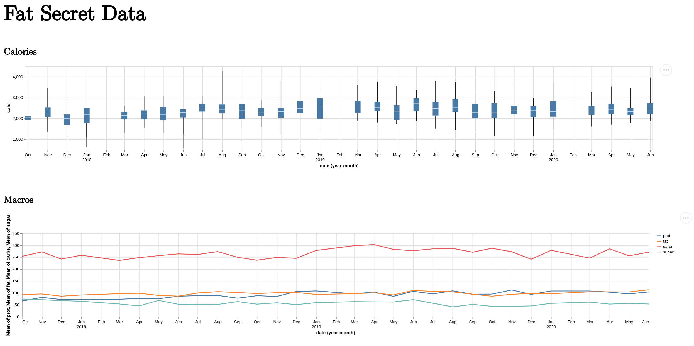

{:title "📈 Vega-Lite Fun Pt-1" :layout :post :tags ["clj" "clojure" "vega-lite" "vega" "oz"]}

I'm obsessive about tracking personal metrics, and I want to make data visualizations. This is an initial attempt at exploring my own data, and [Vega-Lite](https://vega.github.io/vega-lite/) as a tool to visualize it. I'm using [Oz](https://github.com/metasoarous/oz) as a Vega-Lite wrapper because the setup was _easy_.

# Final product


I'm not sure why February is missing. I think there was something weird about data exports in those months and the data dropped in processing.  

[Source code for this post](https://github.com/jgoodhcg/playground/blob/b752b1db752f8412b6f834070451150c44efa7f2/src/fat_secret.clj)

# Data

A few years ago I used Myfitnesspal. I found out after a year of tracking that it only had aggregate meal time macros in its export. I switched to Fat Secret for that reason. It turns out that Fat Secret has more precise data but it is difficult to parse. I've since moved on to [Cronometer](https://cronometer.com/?utm_source=jgood-blog&utm_medium=vega-lite-pt-1-post&utm_campaign=justin-showing-up-in-your-analytics). It's data export is a perfectly parsable csv. However, I have over a year's worth of daily nutritional info in Fat Secret so this post is about getting that into a graph.

## Example of an export _csv_ document from Fat Secret:

```
#-------------------------------------------
# Food Diary Report - Detailed Report,"Tuesday, May 1, 2018","Thursday, May 31, 2018"
#-------------------------------------------

#-------------------------------------------
# Period Summary
#-------------------------------------------
Daily Average,Cals ( kcal),Fat( g),Carbs( g),Prot( g)
Total,2229,89.21,256.23,75.28
Breakfast,387,15.98,53.14,10
Lunch,585,25.51,69.9,19.78
Dinner,781,31.55,84.97,26.31
Snacks/Other,476,16.17,48.22,19.2

#-------------------------------------------
# Report Details
#-------------------------------------------
Date,Cals ( kcal),Fat( g),Sat( g),Carbs( g),Fiber( g),Sugar( g),Prot( g),Sod( mg),Chol( mg),Potassium( mg)

"Tuesday, May 1, 2018",1523,46.06,20.721,122.24,6,71.9,69.23,3297,206,348
 Breakfast,250,4,1,26,0,22,26,1274,70,0
  Trader Joe's Wild Salmon Jerky,160,4,1,4,0,2,26,1260,70,
"   2  x 1 oz, 56 g"
  Dynasty Oolong Tea,0,0,,0,,,0,5,0,
"   1 teabag, 240 ml"
  Water,0,0,0,0,0,0,0,9,0,
   2 cups (8 fl oz)
  Wonka Nerd Rope,90,0,0,22,0,20,0,0,0,0
   1 rope
 Lunch,80,2,0.5,2,0,1,13,635,35,10
  Trader Joe's Wild Salmon Jerky,80,2,0.5,2,0,1,13,630,35,
"   1 oz, 28 g"
  Bigelow Tea Green Tea,0,0,0,0,0,0,0,0,0,10
"   8 fl oz, 240 ml"
  Water,0,0,0,0,0,0,0,5,0,
   1 cup (8 fl oz)
 Dinner,908,40.06,19.221,94.24,6,48.9,30.23,1307,101,328
  Multigrain Bread,196,2.96,0.629,36.19,5,7.84,7.8,380,0,159
   3 regular slices
  Goats Cheese (Soft),228,17.93,12.396,0.76,0,0.76,15.75,313,39,22
   3 oz
  Cheese-Filled Pastry,154,11.28,4.23,8.47,0.2,1.67,4.63,304,47,55
   2 pastries
  Water,0,0,0,0,0,0,0,5,0,
   1 cup (8 fl oz)
  Vodka,64,0,0,0,0,0,0,0,0,1
   1 fl oz (no ice)
  Club Soda,0,0,0,0,0,0,0,75,0,7
   1 can or bottle (12 fl oz)
  Cupcake with Icing,266,7.89,1.966,48.82,0.8,38.63,2.05,230,15,84
   1 1/2 cupcakes (2-3/4" dia)
 Snacks/Other,285,0,0,0,0,0,0,81,0,10
  Vodka,64,0,0,0,0,0,0,0,0,1
   1 fl oz (no ice)
  Gin,221,0,0,0,0,0,0,1,0,2
   2 jiggers
  Club Soda,0,0,0,0,0,0,0,75,0,7
   1 can or bottle (12 fl oz)
  Glaceau Smartwater - Electrolyte Enhanced Water (33.8 oz),0,0,0,0,0,0,0,0,0,0
"   1 bottle, 33.8 oz"
  Water,0,0,0,0,0,0,0,5,0,
   1 cup (8 fl oz)
```

Each level of specificity nests below the next. You can see towards the top that there is a day heading with macro information for the whole day.

```
"Tuesday, May 1, 2018",1523,46.06,20.721,122.24,6,71.9,69.23,3297,206,348
```

 Directly below that is a meal heading with aggregate information about the meal.

```
 Breakfast,250,4,1,26,0,22,26,1274,70,0
```

Directly below that is information on each meal item. Notice how the meal item is broken into two lines. The top line has the item with macro information, the bottom line has a measurement for the amount consumed. This measurement is not consistent in form.

```
  Trader Joe's Wild Salmon Jerky,160,4,1,4,0,2,26,1260,70,
"   2  x 1 oz, 56 g"
```

The measurement above shows `"`'s wrapping, an `x` to indicate quantity of measurement, and a comma with a standardized measurement after it. Another example of a meal item has none of those things.

```
  Wonka Nerd Rope,90,0,0,22,0,20,0,0,0,0
   1 rope
```

After the last meal item of Breakfast there will be the next meal heading for Lunch. The same happens for meal headings and days.


## Transformation
When considering how to parse this I found two things that looked promising. The first was [from juxt](https://juxt.pro/blog/parsing-with-clojure-spec) and used `spec`. The second was [Instaparse](https://github.com/Engelberg/instaparse), based on `context free grammars`. I went with spec 🤷. In hindsight I should have taken the time to learn Instaparse. 

### Making a spec for each type of heading

```clojure
(ns fat-secret
  (:require [clojure.spec.alpha :as s]))

(s/def ::day-heading
  (s/cat
    :day-of-week #{"\"Monday" "\"Tuesday" "\"Wednesday" "\"Thursday" "\"Friday" "\"Saturday" "\"Sunday"}
    :month-day #(re-matches #"^\s{1}(January|Febuary|March|April|May|June|July|August|September|October|November|December){1}\s[0-9]{1,2}" %)
    :year #(re-matches #"^\s{1}[0-9]{4}\"" %)

    ;; should check on the order in the export sheet before trusting this
    :cals (s/? blank-or-float?)
    :fat (s/? blank-or-float?)
    :sat (s/? blank-or-float?)
    :carbs (s/? blank-or-float?)
    :fiber (s/? blank-or-float?)
    :sugar (s/? blank-or-float?)
    :prot (s/? blank-or-float?)
    :sod (s/? blank-or-float?)
    :chol (s/? blank-or-float?)
    :potassium (s/? blank-or-float?)
    ))

(s/def ::meal-heading
  (s/cat
    :meal #{" Breakfast" " Lunch" " Dinner" " Snacks/Other"}
    ;; should check on the order in the export sheet before trusting this
    :cals (s/? blank-or-float?)
    :fat (s/? blank-or-float?)
    :sat (s/? blank-or-float?)
    :carbs (s/? blank-or-float?)
    :fiber (s/? blank-or-float?)
    :sugar (s/? blank-or-float?)
    :prot (s/? blank-or-float?)
    :sod (s/? blank-or-float?)
    :chol (s/? blank-or-float?)
    :potassium (s/? blank-or-float?)))

(s/def ::item-heading
  (s/cat
    :description string?
    ;; should check on the order in the export sheet before trusting this
    :cals (s/? blank-or-float?)
    :fat (s/? blank-or-float?)
    :sat (s/? blank-or-float?)
    :carbs (s/? blank-or-float?)
    :fiber (s/? blank-or-float?)
    :sugar (s/? blank-or-float?)
    :prot (s/? blank-or-float?)
    :sod (s/? blank-or-float?)
    :chol (s/? blank-or-float?)
    :potassium (s/? blank-or-float?)))
```
These specs all use `s/cat` to take a collection of values and turn them into a keyed map. The `s/?` in each keyed predicate means that it matches zero or 1. In practice this means that when the spec finds a value for that key it moves on to the next key.

### Getting the files ready for processing

```clojure
(def files (->> "/absolute/path/to/files"
                (clojure.java.io/file)
                (file-seq)
                (filter #(.isFile %))
                (map #(-> %
                          (.toPath)
                          (.toString)))
                (filter #(str/includes? % "eml"))))
```

This snippet iterates over everything in a directory, checking that it is a file, converting it's path to a string, and then looking for a specific file format. The result is a collection of absolute file paths as strings.

### Turning the file paths into a piece of data to process

```clojure
(defn load-lines [file]
  (with-open [rdr (clojure.java.io/reader file)]
    (into [] (line-seq rdr))))

(def data
  (time (->> files
             (into [] (map load-lines))
             (flatten)
             (transform-lines))))
```

This snippet takes the collection of file paths and maps over them with a reader that puts all of their lines into a collection. Those collections load into another collection. The result is a nested collection of every line in all the files. `flatten` turns it into a single collection of every line in all the files.

### Transforming the lines

```clojure
(defn transform-lines [lines]
  (->> lines
       (reduce
         (fn [data line]
           (let [item            (clojure.string/split line #",")
                 maybe-day-data  (->> item (s/conform ::day-heading) (zero-fill))
                 maybe-meal-data (->> item (s/conform ::meal-heading) (zero-fill))
                 maybe-item-data (->> item (s/conform ::item-heading) (zero-fill))]
```

Each spec uses `s/cat` which expects a collection of order sensitive values. Each line parsed is split by its `,` comma delimiter and passed into `s/conform`. What comes out of `s/conform` is a map of data. 

The lines are `reduce`-ed by a function that uses layered conditionals to figure out what the line is and then put it in the right spot of the reduced `data`.

```clojure
(reduce
         (fn [data line]
           (let [item            (clojure.string/split line #",")
                 maybe-day-data  (->> item (s/conform ::day-heading) (zero-fill))
                 maybe-meal-data (->> item (s/conform ::meal-heading) (zero-fill))
                 maybe-item-data (->> item (s/conform ::item-heading) (zero-fill))]

             ;; when it is a day
             (if (valid-conform? maybe-day-data)
               ...;; if it isn't a day, meal, meal-item, or meal-item-amount then it is we shouldn't do anything with it
                       (do
                         (println "Following line was not a day, meal, item, or amount")
                         (println item)
                         (println)
                         data))))))))
               ;; otherwise check if it's a meal
               (if (valid-conform? maybe-meal-data)
               ...

                 ;; if the line has fallen through this far then
                 ;; it's either an item or an item amount
                 ;; we can do some loose counting that should be write most of the time
                 (let [is-item-heading   (-> item
                                             (count)
                                             (> 2))
                       is-item-amount    (-> item
                                             (count)
                                             (<= 2))
                       prev-meal-keyword @last-meal-edited]

                   (if (and is-item-heading
                            (valid-conform? maybe-item-data))
                    ...
                     ;; when it is an item amount then add the :amount key to the last item from the last meal edited on the last day in the list
                     ;; there are some lines that might be misinterpreted by this loose conform
                     ;; those are all in the beginning of the document before a valid day
                     ;; data should be empty until a valid day is reached
                     ;; sp/transform won't add anything until all the levels above :items LAST are valid
                     (if is-item-amount
                     ...
                       ;; if it isn't a day, meal, meal-item, or meal-item-amount then it is we shouldn't do anything with it
                       (do
                         (println "Following line was not a day, meal, item, or amount")
                         (println item)
                         (println)
                         data))))))))
```

`valid-conform?` is a function that checks the result from the `s/conform` call for an _invalid_ keyword.

```clojure
(defn valid-conform? [x]
  (not= :clojure.spec.alpha/invalid x))
``` 

One really ugly part of this is using an atom to remember context of the _last meal_.

```clojure
               ;; otherwise check if it's a meal
               (if (valid-conform? maybe-meal-data)
                 ;; when it is then build out the meal data and leave items empty
                 (let [meal-keyword (-> maybe-meal-data
                                        (:meal)
                                        (clojure.string/trim)
                                        (clojure.string/lower-case)
                                        (clojure.string/replace #"/" "-")
                                        (keyword))]

                   ;; some brittle state
                   ;; saves the the meal keyword, :breakfast :lunch ... , for the next line processing
                   ;; the next line will either be a meal item that should go into the saved meal or a new meal
                   (reset! last-meal-edited meal-keyword)
```

The `reset!` remembers the last found meal during parsing. That way when the next meal items are encountered it can update the right spot in the accumulating data object.

```clojure
                 ;; if the line has fallen through this far then
                 ;; it's either an item or an item amount
                 ;; we can do some loose counting that should be write most of the time
                 (let [is-item-heading   (-> item
                                             (count)
                                             (> 2))
                       is-item-amount    (-> item
                                             (count)
                                             (<= 2))
                       prev-meal-keyword @last-meal-edited]

                   (if (and is-item-heading
                            (valid-conform? maybe-item-data))
                     ;; when it is a meal-item then add it to the last day's last meal's :items list
                     ;; there are some lines that might be misinterpreted by this loose conform
                     ;; those are all in the beginning of the document before a valid day
                     ;; data should be empty until a valid day is reached
                     ;; sp/transform won't add anything until all the levels above :items are valid
                     (->> data
                          (sp/transform
                            [sp/LAST :meals prev-meal-keyword :items]
                            (fn [meal-items]
                              (conj meal-items maybe-item-data))))
```

`sp/transform` is a [specter](https://github.com/redplanetlabs/specter) function that uses the path to update a piece of nested data. You can see the use of `prev-meal-keyword` from the atom to find the right meal to place the meal item under. The day is easy to know without any state from the atom because it is always the _last_ day.

### Visualization

Visualizing with Vega-Lite is all declarative.

With `Oz` just call `start-server!` and then `view!` with a map of data.

```clojure
(oz/start-server!)
...

(def calories-line-plot
  {:data  {:values data}
   :width 1500
   :layer [{:mark     {:type "boxplot" :extent "min-max"}
            :encoding {:x {:field    "date"
                           :type     "temporal"
                           :timeUnit "yearmonth"
                           :axis     {:labelExpr "[timeFormat(datum.value, '%b'), timeFormat(datum.value, '%m') == '01' ? timeFormat(datum.value, '%Y') : '']"}}
                       :y {:field "cals"
                           :scale {:zero false}
                           :type  "quantitative"}}}]})

(def macro-line-plot
  {:data   {:values data}
   :repeat {:layer ["prot" "fat" "carbs" "sugar"]}
   :spec   {:width    1500
            :mark     "line"
            :encoding {:x     {:field    "date"
                               :type     "temporal"
                               :timeUnit "yearmonth"
                               :axis     {:labelExpr "[timeFormat(datum.value, '%b'), timeFormat(datum.value, '%m') == '01' ? timeFormat(datum.value, '%Y') : '']"}}
                       :y     {:field {:repeat "layer" } :type "quantitative" :aggregate "mean"}
                       :color {:datum {:repeat "layer" :type "nominal"}}}}})

(def viz
  [:div
   [:h1 "Fat Secret Data"]
   [:div
    [:h3 "Calories"]
    [:vega-lite calories-line-plot]]
   [:div
    [:h3 "Macros"]
    [:vega-lite macro-line-plot]]])

;; Render the plot
(oz/view! viz)
```

The `calories-line-plot` is actually a box plot. It also uses a `:layer` keyword that is redundant as there is only one layer. I went through a lot of experimentation with graph and am unhappy with `:timeunit` options. I wanted to get a line plot showing each week but I could not make that happen.

The `macro-line-plot` uses a `:repeat` with `:layer` to create the same `:mark` and `:encoding` for four different values `["prot" "fat" "carbs" "sugar"]`. The `{:repeat "layer"}` in the `:encoding` is a placeholder for each value to fill as it renders the layers.

I'm not happy with the string building of label expressions either. It would be nice if `:labelExpr` took structured data instead.
