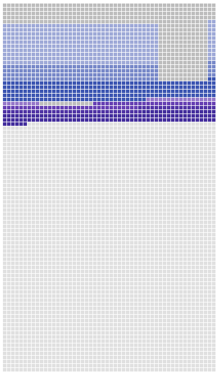

{:title "💀 Memento Mori Life Chart Experiment" :layout :post :tags ["clj" "clojure" "memento mori" "reagent" "tick" "time"]}

## Inspiration
I came across two websites with a visualization of a 90 year old life measured in weeks. 
- [Your life in weeks](https://waitbutwhy.com/2014/05/life-weeks.html)
- [Week countdown](https://www.failflow.com/die/1477)

I thought it would be fun to figure out how to make a single page app that let people add their life events and periods. This project is an initial experiment towards that.

## Result
  

Each square is one week. It starts on my birthday and ends 90 years later.  

The blue represents all the time I spent in school. Lightest blue starts elementary school to the darkest blue which is college. Notice the summer vacations throughout elementary middle and high school.  

The purple represents all of my post college software developer career. Three jobs so far, starting a fourth in a couple of weeks!  

I only added school and work because I'm boring and a capitalist drone.  

[👩‍💻 Here is the full source code.‍](https://github.com/jgoodhcg/playground/blob/ec3f6e0ca20befda0750f924e50cb30d78be335f/src/memento_mori/index.cljs)

## Interesting code

### Life periods
Each period is a simple map with a beginning time stamp, end, name and color.  
```clojure
{:name           "Wyoming IT intern"
 :color          deep-purple-300 ;; just a hex string (def deep-purple-300 "#9575cd")
 :tick/beginning (ld/of 2015 5 19)
 :tick/end       (ld/of 2015 11 13)}
```

The end time stamp is optional, the visualization will paint a full box if an event just has a beginning.

#### Summer vacations
To make the summer vacation gaps I made a little map function to generate school years. The beginning and end dates are not exact, but they are close enough.
```clojure
(->> 10 range (map (fn [y]
                         {:name           "elementary and middle school"
                          :color          indigo-200
                          :tick/beginning (ld/of (+ 1996 y) 9 5)
                          :tick/end       (ld/of (+ 1997 y) 6 6)})))
```

### Data structure of the visualization
This map represents everything needed to make the visualization. Eventually this will get a spec and will be the re-frame app state.
```clojure
{:years [{:year  2000
          :weeks [{:week-start #object[LocalDate 2000-09-05]
                   :week-end   #object[LocalDate 2000-09-22]
                   :included-events [{:name ""
                                      :color ""}]}]}]}
```

For now it just generates once on run and visualizes with render functions.

### Determining if a life period is on a week using tick
[Tick](https://www.juxt.land/tick/docs/index.html) is an interesting time library for clojure. It has a [comparison](https://www.juxt.land/tick/docs/index.html#_comparison_4) function that makes it really simple to know the relation between two time intervals. It made it rather easy to write the overlap determination between a week cell and life period.

```clojure
(defn event-overlap? [week-start week-end event]
  (let [week            {:tick/beginning week-start
                         :tick/end       week-end}
        event-corrected {:tick/beginning (:tick/beginning event)
                         :tick/end       (if-some [e (:tick/end event)] e (:tick/beginning event))}]
    (not (some? (some #{:precedes :preceded-by} [(t/relation event-corrected week)])))))
```

That function looks at the _relation_ between the two intervals (two sets of dates). As long as the relation is not of the two types `:precedes` or `:preceded-by` then the two intervals overlap in some way. `(not (some? (some ...)))` is just a _clever_ way of saying the result is not one of those two options in a set.
