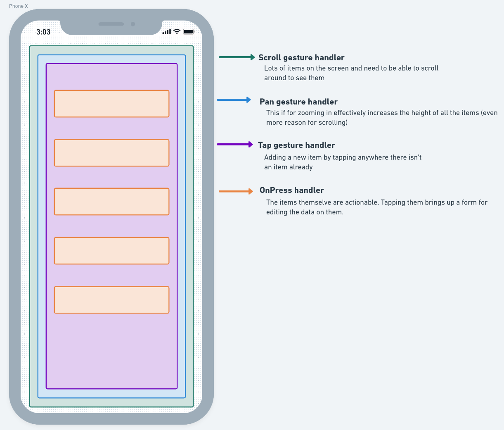

{:title "❌ Failed Gesture Experiment" :layout :post :tags ["clj" "cljs" "reagent" "expo" "react-native" "react-native-gesture-handler"]}

## Gist
I had an idea for a complicated set of gestures for an app I'm working on. Not being sure how it would work I made an experiment app to test it out. Ran into two problems so I'm tossing the whole idea.

## Intro
The idea here is that when the app is in a state with nothing selected the user could use gestures to:
- Scroll a list of items
- Pinch to zoom (effectively increasing the height of the items like when zooming into a calendar agenda)
- Tap to add an item anywhere there isn't already an item
- Tap to select an item

Here is a visualization of the nested handlers. If you can't see the colors the arrows follow the nesting pattern.


The problems I ran into are at the bottom of the post.

## Building log
Using [create-cljs-expo-app](https://www.npmjs.com/package/create-expo-cljs-app) creation kit I started a blank project.  

After that I added [react-native-gesture-handler](https://docs.swmansion.com/react-native-gesture-handler/docs/#managed-expo) dependency with:
```shell
expo install react-native-gesture-handler
```

and required it with
```clojure
(ns app.index
  (:require 
    ;; ...
    ["react-native-gesture-handler" :as g]
    ;; ...
    ))
```

Needed some stub items that could make `n` number of things
```clojure
(defn items [n]
  [:> rn/View
   (for [i (->> n range (map inc))]

     [:> g/RectButton
      {:style    {:height           55
                  :width            "70%"
                  :margin           10
                  :background-color "orange"}
       :key      (str (random-uuid))
       :on-press (fn [_] (println (str "pressed " i)))}

      [:> rn/View {:accessible true}
       [:> rn/Text (str i)]]])])
```

Modified `screen1` from the template project. There are some stub states here that I didn't get around to messing with. The one that matters here is `no-selection`.
```clojure
(defn screen1 [props]
  (r/as-element
    (let [version         (<sub [:version])
          theme-selection (<sub [:theme])
          theme           (-> props (j/get :theme))
          selected        false
          moving          false]

      [:> paper/Surface {:style {:flex            1
                                 :justify-content "flex-start"}}
       [:> rn/SafeAreaView {:style (-> styles (j/get :surface))}
        [:> rn/StatusBar {:visibility "hidden"}]

        (cond
          (not selected)     [no-selection]
          (and selected
               (not moving)) [selection]
          (and selected
               moving)       [movement])]])))
```

The component with the most important stuff is `no-selection`.
```clojure
(defn no-selection []
  [:> rn/View

   [:> g/ScrollView
    {:ref      scroll-ref
     :wait-for pinch-ref-zoom
     :style    {:height "75%"
                :width  "100%"}}

    [:> g/PinchGestureHandler
     {:ref                     pinch-ref-zoom
      :wait-for                tap-ref-new-item
      :on-handler-state-change (fn [e]
                                 (when (active? e)
                                   (println "zoom")))}
     [:> rn/View
      [:> g/TapGestureHandler
       {:ref                     tap-ref-new-item
        :on-handler-state-change (fn [e] (when (active? e)
                                           (println "new item")))}

       [:> rn/View [items 9]]]]]]])
```
This has each of the handlers with their configuration.

One tricky thing was getting the state from the handler events. `active?` takes in the event and returns a boolean if the handler is in an active state.
```clojure
(ns app.index
  (:require 
   ;; ...
   [applied-science.js-interop :as j]
   ;; ...
  ))
  
(defn active? [evt]
  (-> evt
      (j/get :nativeEvent)
      (j/get :state)
      (= (j/get g/State :ACTIVE))))
```

## Blocking Problems
### Triggering zoom crashes the app
When the zoom handler enters the active state a second time the entire expo client crashes with no errors. I'm not sure if this is a problem with expo, reagent, or gesture handler. I'm guessing gesture handler but I don't have the energy to investigate.

### Can't stop event bubbling
The items have an `:on-press` handler. When that triggers the event handler for tapping also fires. I can't find a way to stop that. The tap handler should only fire when tapping in the area _around_ the items. In browser land there is `preventDefault` but I haven't found as clean of a solution in Expo/React Native land.

## Running away from my problems
One of the core aspects of my _MVP_ is easy UX. These gestures would have been a nice intuitive feature set ... if they worked. I think I can still get _easy UX_ without them though. Zooming will essentially turn into buttons that are well placed. Taping anywhere to add will become a _Floating Action Button_ or a long press.

## All the code for reference
There are things in here that aren't relevant to the set of gestures that don't work, like `bottom-sheet`. I was intending to go further with this experiment and never got around to putting that stuff in.

```clojure
(ns app.index
  (:require
   ["expo" :as ex]
   ["expo-constants" :as expo-constants]
   ["react-native" :as rn]
   ["react" :as react]
   ["@react-navigation/native" :as nav]
   ["@react-navigation/bottom-tabs" :as bottom-tabs]
   ["react-native-gesture-handler" :as g]
   ["react-native-paper" :as paper]
   [applied-science.js-interop :as j]
   [camel-snake-kebab.core :as csk]
   [camel-snake-kebab.extras :as cske]
   [reagent.core :as r]
   [re-frame.core :refer [subscribe dispatch dispatch-sync]]
   [shadow.expo :as expo]
   [app.fx]
   [app.handlers]
   [app.subscriptions]
   [app.helpers :refer [<sub >evt]]))

;; must use defonce and must refresh full app so metro can fill these in
;; at live-reload time `require` does not exist and will cause errors
;; must use path relative to :output-dir
(defonce splash-img (js/require "../assets/shadow-cljs.png"))

(def styles
  ^js (-> {:surface
           {:flex            1
            :justify-content "flex-start"}

           :theme-switch
           {:flex-direction  "row"
            :justify-content "space-between"}}
          (#(cske/transform-keys csk/->camelCase %))
          (clj->js)
          (rn/StyleSheet.create)))

(defn screen2 [props]
  (r/as-element
    [:> paper/Surface {:style (-> styles (j/get :surface))}
     [:> rn/View
      [:> paper/Title "Screen2"]]]))

(def scroll-ref (j/call react :createRef))

(def pinch-ref-zoom (j/call react :createRef))

(def tap-ref-new-item (j/call react :createRef))

(defn active? [evt]
  (-> evt
      (j/get :nativeEvent)
      (j/get :state)
      (= (j/get g/State :ACTIVE))))

(defn items [n]
  [:> rn/View
   (for [i (->> n range (map inc))]

     [:> g/RectButton
      {:style    {:height           55
                  :width            "70%"
                  :margin           10
                  :background-color "orange"}
       :key      (str (random-uuid))
       :on-press (fn [_] (println (str "pressed " i)))}

      [:> rn/View {:accessible true}
       [:> rn/Text (str i)]]])])

(defn playing-items [n]
  [:> rn/View
   (for [i (range n)]
     [:> rn/View {:style {:height           45
                          :width            "40%"
                          :margin           10
                          :background-color "blue"}
                  :key   (str (random-uuid))}
      [:> rn/Text (str (+ 1 i))]])])

(defn no-selection []
  [:> rn/View

   [:> g/ScrollView
    {:ref      scroll-ref
     :wait-for pinch-ref-zoom
     :style    {:height "75%"
                :width  "100%"}}

    [:> g/PinchGestureHandler
     {:ref                     pinch-ref-zoom
      :wait-for                tap-ref-new-item
      :on-handler-state-change (fn [e]
                                 (when (active? e)
                                   (println "zoom")))}
     [:> rn/View
      [:> g/TapGestureHandler
       {:ref                     tap-ref-new-item
        :on-handler-state-change (fn [e] (when (active? e)
                                           (println "new item")))}

       [:> rn/View [items 9]]]]]]])

(defn selection []
  [:> rn/View [:> paper/Text "selection"]])

(defn movement []
[:> rn/View [:> paper/Text "movement"]])

(defn screen1 [props]
  (r/as-element
    (let [version         (<sub [:version])
          theme-selection (<sub [:theme])
          theme           (-> props (j/get :theme))
          selected        false
          moving          false]

      [:> paper/Surface {:style {:flex            1
                                 :justify-content "flex-start"}}
       [:> rn/SafeAreaView {:style (-> styles (j/get :surface))}
        [:> rn/StatusBar {:visibility "hidden"}]

        (cond
          (not selected)     [no-selection]
          (and selected
               (not moving)) [selection]
          (and selected
               moving)       [movement])]])))

(def tab (bottom-tabs/createBottomTabNavigator))

(defn tab-navigator [] (-> tab (j/get :Navigator)))

(defn tab-screen [props] [:> (-> tab (j/get :Screen)) props])

(defn root []
(let [theme           (<sub [:theme])
      !route-name-ref (clojure.core/atom {})
      !navigation-ref (clojure.core/atom {})]

[:> paper/Provider
 {:theme (case theme
           :light paper/DefaultTheme
           :dark  paper/DarkTheme
           paper/DarkTheme)}

 [:> nav/NavigationContainer
  {:ref             (fn [el] (reset! !navigation-ref el))
   :on-ready        (fn []
                      (swap! !route-name-ref merge {:current (-> @!navigation-ref
                                                                 (j/call :getCurrentRoute)
                                                                 (j/get :name))}))
   :on-state-change (fn []
                      (let [prev-route-name    (-> @!route-name-ref :current)
                            current-route-name (-> @!navigation-ref
                                                   (j/call :getCurrentRoute)
                                                   (j/get :name))]
                        (if (not= prev-route-name current-route-name)
                          ;; This is where you can do side effecty things like analytics
                          (>evt [:some-fx-example (str "New screen encountered " current-route-name)]))
                        (swap! !route-name-ref merge {:current current-route-name})))}

  [:> (tab-navigator)
   (tab-screen {:name      "Main screen"
                :component (paper/withTheme screen1)})
   (tab-screen {:name      "Screen2"
                :component (paper/withTheme screen2)})]]]))

(defn start
  {:dev/after-load true}
  []
  (expo/render-root (r/as-element [root])))

(def version (-> expo-constants
                 (j/get :default)
                 (j/get :manifest)
                 (j/get :version)))

(defn init []
  (dispatch-sync [:initialize-db])
  (dispatch-sync [:set-version version])
  (start))
```
