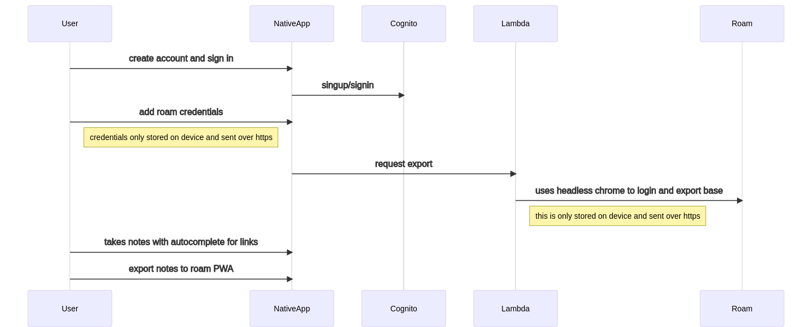

{:title "🗒️ A POC for taking Roam notes on audio" :layout :post :tags ["expo" "cljs" "roam" "podcast" "react-native"]}

My podcast player used to include the current position with the export from the share feature. When it was removed, for whatever reason, it kind of ruined my note process. I like to take quick notes with the position so I can revise by listening back whenever I get around to it. Now I have to include the position manually when I export to Roam's quick capture screen. It's an annoying context switch.  

This problem got me thinking about taking notes on audio in general . There isn't a _good_ solution for the niche of _second brain_ users. I want Roam and Notion integrated directly in the player for seamless note taking without context switching. I actually have the skills needed to build this, so I made a Proof of Concept over a weekend.  

The next step is getting a mobile app in the play and app store.  
[Get on the wait list](https://airtable.com/shrpcaRLwMAixJteh)  

## Vision
### Version 1.0
- ⏯️ Basic management and playing podcast feeds
- 🗒️ Take a text note on an episode tied to a position
- 🧠 Roam page auto-complete in note editor
- 📤 Notes can export individually and get marked when they do

### Long term 
- Audiobooks
- Other app integration -- __notion__
- Profiles and cloud backups
- Synced web app
- Block level syncing with roam

## POC
- I've got playback, note taking, and auto-complete working. I also know how to go about integrating page titles. More on that further down.

<figure class="video_container">
  <video height="800"
         controls="true" 
         allowfullscreen="true" 
         poster="./../../img/2021-02-20-poc-pod-notes/poc-poster.png">
    <source src="https://files.jgood.tech/project-din-demo-001.mp4" type="video/mp4">
  </video>
</figure>

### How v-1.0 will get your Roam page titles
[This unofficial api project](https://github.com/artpi/roam-research-private-api) paired with AWS Lambda can actually create a secure and simple process for a mobile app to get access to your graph's page titles.



### Source code
If you are into it, here is 99% of the POC source code. Fun fact, it's written in _Clojurescript_, the same language Roam is written in!
```clojure
(ns app.index
  (:require
   ["expo" :as ex]
   ["expo-constants" :as expo-constants]
   ["expo-av" :as av]
   ["react-native" :as rn]
   ["react" :as react]
   ["@react-navigation/native" :as nav]
   ["@react-navigation/stack" :as rn-stack]
   ["react-native-paper" :as paper]
   ["react-native-rss-parser" :as rss]
   ["react-native-controlled-mentions" :as cm]
   ["tailwind-rn" :default tailwind-rn]

   [applied-science.js-interop :as j]
   [camel-snake-kebab.core :as csk]
   [camel-snake-kebab.extras :as cske]
   [cljs.core.async :refer [go]]
   [cljs.core.async.interop :refer [<p!]]
   [reagent.core :as r]
   [re-frame.core :refer [subscribe dispatch dispatch-sync]]
   [shadow.expo :as expo]
   [lambdaisland.fetch :as fetch]

   [app.fx]
   [app.handlers]
   [app.subscriptions]
   [app.helpers :refer [<sub >evt]]))

(defn tw [style-str] (-> style-str
                         tailwind-rn
                         (js->clj :keywordize-keys true)))

(def value (r/atom ""))

(def pages ["podcast" "indie-hackers" "Courtland Allen" "marketing" "npm" "project/din"])

(defonce podcast-atom (r/atom nil))

(defonce progress-atom (r/atom
                         {:width    "0%"
                          :duration nil
                          :position nil}))

(defonce playing-atom (r/atom :stopped))

(defonce playback-atom (r/atom nil))

(defonce notes-atom (r/atom {:notes    []
                             :selected nil}))

(defn pad [n] (if (-> n str count (< 2))
                (str "0" n)
                (str n)))

(defn millis->str [millis]
  ;; TODO add padding
  ;; https://stackoverflow.com/a/9763769/5040125
  (let [ms   (rem millis 1000)
        left (-> millis (- ms) (/ 1000))
        sec  (-> left (rem 60))
        left (-> left (- sec) (/ 60))
        min  (-> left (rem 60))
        hr   (-> left (- min) (/ 60))]
    (str (pad hr) ":" (pad min) ":" (pad sec))))

(defn page-suggestions [e]
  (let [on-suggest  (-> e (j/get :onSuggestionPress))
        maybe-page  (-> e (j/get :keyword))
        suggestions (when (-> maybe-page count (> 0))
                      (->> pages
                           (filter #(re-find (re-pattern (str "(?i)" maybe-page)) %))))]
    (when (some? maybe-page)
      (r/as-element
        [(fn []
           [:> rn/View
            (for [title suggestions]
              [:> paper/List.Item
               {:key      (str (random-uuid))
                :title    title
                :on-press #(on-suggest #js {:id (str (random-uuid)) :name title})}])])]))))

(defn get-notes []
  (let [notes @notes-atom]
    {:notes          (-> notes :notes)
     :selected-index (-> notes :selected)
     :selected-note  (-> (-> notes :notes)
                         (get (-> notes :selected) nil))} ))

(defn my-text-input []
  (let [{:keys [selected-index selected-note]} (get-notes)]
    [:> cm/MentionInput
     {:style                  (tw "text-gray-50")
      :text-align             "left"
      :text-align-vertical    "top"
      :multi-line             true
      :number-of-lines        10
      :placeholder            "Make note here"
      :placeholder-text-color (:color (tw "text-gray-500"))
      :value                  (:text selected-note)
      :on-change              #(swap! notes-atom assoc-in [:notes selected-index :text] %)

      :part-types
      [{:trigger                   "#"
        :getPlainString            #(-> % (j/get :name) ((fn [s] (str "[[" s "]]"))))
        :isInsertSpaceAfterMention true
        :textStyle                 (tw "text-blue-400")
        :renderSuggestions         page-suggestions}]}]))

(defn on-status-change [status]
  (j/let [^:js {:keys [isLoaded isPlaying positionMillis durationMillis]} status]
    (if isLoaded
      (reset! playing-atom (if isPlaying :playing :stopped))
      (reset! playing-atom :loading))

    (reset! progress-atom {:width    (-> positionMillis
                                         (/ durationMillis)
                                         (* 100)
                                         (str "%"))
                           :position positionMillis
                           :duration durationMillis})))

(defn on-initial-play [episode-uri]
  (go (-> av
          (j/get :Audio)
          (j/get :Sound)
          (j/call :createAsync
                  #js {:uri episode-uri}
                  #js {:shouldPlay true}
                  on-status-change)
          <p!
          ((fn [x] (reset! playback-atom (j/get x :sound)))))))

(defn on-add-note []
  (when-some [position (-> @progress-atom :position)]
    (swap! notes-atom
           #(do
              (-> %
                  (assoc :selected (-> % :notes count)) ;; new note isn't added yet "off by one"
                  (update-in [:notes] conj
                             {:position position
                              :left     (-> position
                                            (/ (-> @progress-atom :duration))
                                            (* 100)
                                            (str "%"))
                              :text     ""}))))))

(defn on-forward-30 []
  (when-some [playback @playback-atom]
    (let [{:keys [position duration]} @progress-atom]
      (-> playback (j/call :setPositionAsync
                           (-> position (+ 30000)
                               (min (-> duration (- 30000)))))))))

(defn on-backward-30 []
  (when-some [playback @playback-atom]
    (let [{:keys [position]} @progress-atom]
      (-> playback (j/call :setPositionAsync
                           (-> position (- 30000)
                               (max 30000)))))))

(defn on-next-note []
  (swap! notes-atom
         (fn [na-val]
           (let [max       (count (:notes na-val))
                 new-index (min (inc (:selected na-val))
                                max)]
             (assoc-in na-val [:selected] new-index)))))

(defn on-prev-note []
  (swap! notes-atom
         (fn [na-val]
           (let [new-index (max (dec (:selected na-val))
                                0)]
             (assoc-in na-val [:selected] new-index)))))

(defn on-share []
  (let [{:keys [selected-note]} (get-notes)
        position                (:position selected-note)
        position-str            (-> position millis->str)
        text                    (-> selected-note
                                    :text
                                    (cm/replaceMentionValues
                                      (fn [mt] (str "[[" (j/get mt :name) "]]"))))
        podcast                 @podcast-atom
        title                   (-> podcast (j/get :title))
        episode                 (-> podcast (j/get :items) first)
        episode-title           (-> episode (j/get :title))]
    (-> rn/Share
        (j/call :share #js {:message (str "Note from " title " \n "
                                          "episode: " episode-title " \n "
                                          "position: " position-str " \n "
                                          text " \n "
                                          "https://cool-podcast-notes.io/" (random-uuid) "/p=" position)}))))

(defn screen1 [props]
  (r/as-element
    [(fn []
       (let [podcast                 @podcast-atom
             playing                 @playing-atom
             progress                @progress-atom
             progress-width          (:width progress)
             position-str            (-> progress :position millis->str)
             duration-str            (-> progress :duration millis->str)
             image-uri               (-> podcast (j/get :image) (j/get :url))
             title                   (-> podcast (j/get :title))
             episode                 (-> podcast (j/get :items) first)
             episode-title           (-> episode (j/get :title))
             episode-uri             (-> episode (j/get :enclosures) first (j/get :url))
             on-initial-play         #(on-initial-play episode-uri)
             playback                @playback-atom
             on-play                 #(-> playback (j/call :playAsync))
             on-pause                #(-> playback (j/call :pauseAsync))
             {:keys [notes
                     selected-note]} (get-notes)]

         [:> rn/SafeAreaView {:style (tw "flex flex-1")}
          [:> rn/StatusBar {:visibility "hidden"}]
          [:> paper/Surface {:style (tw "flex flex-1 bg-gray-900")}
           [:> rn/View {:style (tw "flex flex-1 justify-start")}
            ;; podcast info
            [:> rn/View {:style (tw "flex flex-row flex-nowrap p-2")}
             ;; image
             [:> paper/Card.Cover {:source {:uri image-uri}
                                   :style  (tw "h-28 w-28")}]

             ;; title
             [:> rn/View {:style (tw "flex flex-col ml-2 mr-32")}
              [:> paper/Title title]
              [:> paper/Text episode-title]]]

            ;; progress bar and notes
            [:> rn/View {:style (tw "mt-2 px-2 h-80")}
             [:> rn/View {:style (tw "h-full w-full")}
              ;; progress bar
              [:> rn/View {:style (tw "absolute left-0 w-full h-4 bg-purple-400 opacity-50 rounded") }]
              [:> rn/View {:style (merge {:width progress-width} (tw "absolute left-0 h-4 bg-purple-400 rounded-l"))}]
              [:> rn/View {:style (tw "absolute right-0 top-4")} [:> paper/Text {:style (tw "text-gray-400")} duration-str]]
              [:> rn/View {:style (tw "absolute left-0 top-4")} [:> paper/Text {:style (tw "text-gray-400")} position-str]]

              ;; notes
              (for [{:keys [left]} notes]
                [:> rn/View {:key   (random-uuid)
                             :style (merge {:left left} (tw "absolute w-1 h-4 bg-gray-200 "))}])

              ;; selected note
              (when-some [{:keys [left]} selected-note]
                [:> rn/View {:style (merge {:left left} (tw "absolute -top-1 w-1 h-12 bg-yellow-400 rounded-t"))}])

              (when (some? selected-note)
                [:> rn/View {:style (tw "absolute left-0 top-11 w-full h-64 bg-gray-700 border-4 border-yellow-400 rounded")}
                 [:> rn/View {:style (tw "p-4")}
                  [my-text-input]]])

              (when (some? selected-note)
                [:> rn/View {:style (tw "absolute right-2 bottom-6")}
                 [:> paper/IconButton {:icon "share" :on-press on-share :size 24}]])]]


            ;; controlls
            [:> rn/View {:style (tw "flex flex-row justify-between items-center px-4 h-32")}
             [:> paper/IconButton {:icon "arrow-left" :on-press on-prev-note}]
             [:> paper/IconButton {:icon "rewind" :disabled true}]
             [:> paper/IconButton {:icon "rewind-30" :on-press on-backward-30}]

             (case playing
               :stopped [:> paper/IconButton {:icon "play" :size 42 :on-press (if (some? playback) on-play on-initial-play)}]
               :playing [:> paper/IconButton {:icon "pause" :size 42 :on-press on-pause}]
               :loading [:> paper/ActivityIndicator {:animating true :size 42}])

             [:> paper/IconButton {:icon "fast-forward-30" :on-press on-forward-30}]
             [:> paper/IconButton {:icon "fast-forward" :disabled true}]
             [:> paper/IconButton {:icon "arrow-right" :on-press on-next-note}]]

            ;; add note
            [:> rn/View {:style (tw "flex flex-row justify-end mt-4 p-2")}
             [:> paper/Button {:mode "contained" :icon "note" :on-press on-add-note} "Add note"]]]]]))]))

(def stack (rn-stack/createStackNavigator))

(defn navigator [] (-> stack (j/get :Navigator)))

(defn screen [props] [:> (-> stack (j/get :Screen)) props])

(defn root []
  (let [theme           (<sub [:theme])
        !route-name-ref (clojure.core/atom {})
        !navigation-ref (clojure.core/atom {})]

    [:> paper/Provider
     {:theme (case theme
               :light paper/DefaultTheme
               :dark  paper/DarkTheme
               paper/DarkTheme)}

     [:> nav/NavigationContainer
      {:ref             (fn [el] (reset! !navigation-ref el))
       :on-ready        (fn []
                          (swap! !route-name-ref merge {:current (-> @!navigation-ref
                                                                     (j/call :getCurrentRoute)
                                                                     (j/get :name))}))
       :on-state-change (fn []
                          (let [prev-route-name    (-> @!route-name-ref :current)
                                current-route-name (-> @!navigation-ref
                                                       (j/call :getCurrentRoute)
                                                       (j/get :name))]
                            (when (not= prev-route-name current-route-name)
                              ;; This is where you can do side effecty things like analytics
                              (>evt [:some-fx-example (str "New screen encountered " current-route-name)]))
                            (swap! !route-name-ref merge {:current current-route-name})))}

      [:> (navigator) {:header-mode "none"}
       (screen {:name      "Screen1"
                :component (paper/withTheme screen1)})]]]))

(defn start
  {:dev/after-load true}
  []
  (go (-> "https://feeds.transistor.fm/the-indie-hackers-podcast"
          (fetch/get {:mode "no-cors"})
          <p!
          :body
          (->> (j/call rss :parse))
          <p!
          (->> (reset! podcast-atom))))
  (expo/render-root (r/as-element [root])))

(defn init []
  (dispatch-sync [:initialize-db])
  (start))
```
